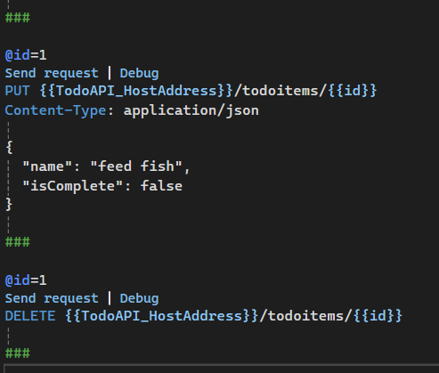

# Bài 1
## Bước 1: Tạo Proj
- Tạo Proj ASP.NET Core Empty với tên Proj là TodoAPI:
    - 
    - 
    - 
- Chạy thử nghiệm Proj code sau
    - 
    - Kết quả nhận được
        - 

## Bước 2: Tải package và tạo các đối tượng
- Thêm package Microsoft.EntityFrameworkCore.InMemory
    - 
- Thêm package Microsoft.AspNetCore.Diagnostics.EntityFrameworkCore
    - 
- Tạo lớp Todo
    - 
- Tạo lớp TodoDB
    - 

## Bước 3: Thêm API code
- 

## Bước 4: Test API
- Chọn Endpoints Explorer
    - 
    - 
- Thử HTTP POST
    - Chuột phải vào POST method, chọn Generate Request
        - 
        - 

    - Thay đổi phần code json
        - 

    - Chọn nút Send Request ở phía trên
        - 
    - Kết quả:
        - 
- Thử HTTP GET
    - Làm tương tự như ở trên
        - 
    - Kết quả lần lượt từ trên xuống:
        - 
        - 
        - 
- Thử HTTP PUT và HTTP DELETE
    - Làm tương tự như trên
        - 
    - Kết quả lần lượt từ trên xuống:
        - 
        - 