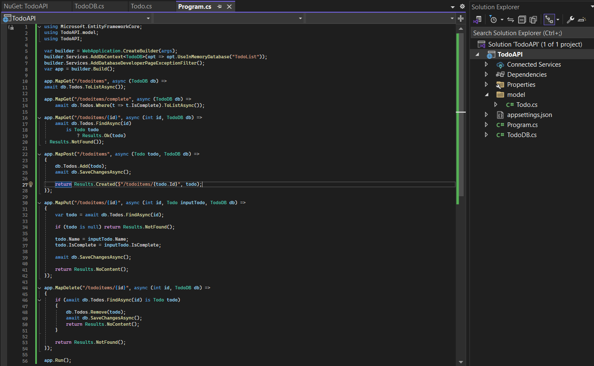

# Bài 1
## Bước 1: Tạo Proj
- Tạo Proj ASP.NET Core Empty với tên Proj là TodoAPI:
    - 
    - 
    - 
- Chạy thử nghiệm Proj code sau
    - 
    - Kết quả nhận được
        - 

## Bước 2: Tải package và tạo các đối tượng
- Thêm package Microsoft.EntityFrameworkCore.InMemory
    - 
- Thêm package Microsoft.AspNetCore.Diagnostics.EntityFrameworkCore
    - 
- Tạo lớp Todo
    - 
- Tạo lớp TodoDB
    - 

## Bước 3: Thêm API code
- 

## Bước 4: Test API
- Chọn Endpoints Explorer
    - 
    - 
- Thử HTTP POST
    - Chuột phải vào POST method, chọn Generate Request
        - 
        - 

    - Thay đổi phần code json
        - 

    - Chọn nút Send Request ở phía trên
        - 
    - Kết quả:
        - 
- Thử HTTP GET
    - Làm tương tự như ở trên
        - 
    - Kết quả lần lượt từ trên xuống:
        - 
        - 
        - 
- Thử HTTP PUT và HTTP DELETE
    - Làm tương tự như trên
        - 
    - Kết quả lần lượt từ trên xuống:
        - 
        - 

# Bài 2
## Bước 1: Cài MongoDB COmpass và tạo database
- Tạo connection
    - 
- Nhấn save and connect
    - 
- Tạo database
    - 
- Insert database
    - 
    - 
- Chỉnh sửa file appsetting.json
    - 

## Bước 2: Tạo API
- Tạo Proj
    - 
    - 
    - 
- Tải package MongoDB
    - 
- Tải package Swashbuckle.AspNetCore.SwaggerGen
    - 
- Tải package Swashbuckle.AspNetCore.SwaggerUI
    - 

## Bước 3: Tạo Models
- 
- 
- 

## Bước 4: Thay đổi code file Program.cs
- 

## Bước 5: Thêm thư file Services/BookService.cs
- 

## Buowcs 6: Thêm đoạn code sau vào Program.cs
- 

## Bước 7: Thêm file Controller/BookController.cs
- 

## Bước 8: Sau khi chạy chương trình
- 

- Test chức năng:
    - Lấy toàn bộ data
        - 
    - Lấy data theo id
        - 
    - Chỉnh sửa một item
        - 
    - Xóa một item
        - 